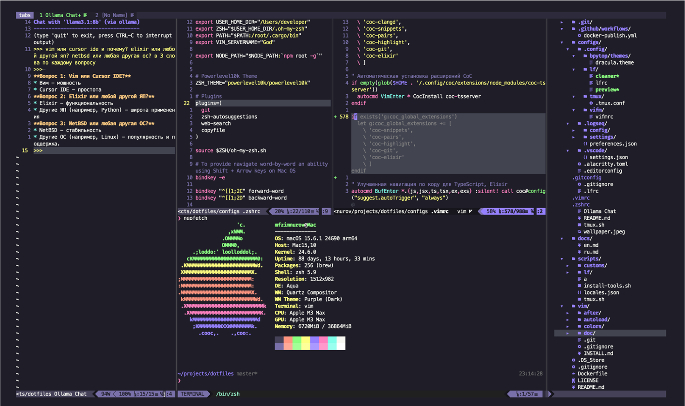

# Dotfiles & Development Tools


Environment configuration and development tools setup automation.

[🇷🇺 Русская версия](docs/ru.md) | [🇬🇧 English version](docs/en.md)

## Demo

### Vim



## Quick Start

### macOS

```bash
git clone https://github.com/the-homeless-god/dotfiles.git ~/dotfiles
cd ~/dotfiles/scripts
./install-tools.sh
```

#### Interactive Mode

For more control over what gets installed, use the interactive mode:

```bash
./install-tools.sh --interactive
```

This provides a checkbox interface to select specific tool categories and individual tools.

### Docker

#### Using pre-built image

```bash
# Run container
docker pull ghcr.io/the-homeless-god/dotfiles:latest
docker run -it --name dotfiles ghcr.io/the-homeless-god/dotfiles:latest

# To reconnect to the container later
docker start dotfiles
docker exec -it dotfiles /bin/bash
```

#### Building locally

```bash
# Build and run container
docker build -t dotfiles-test .
docker run -it --name dotfiles-dev dotfiles-test

# To reconnect to the container later
docker start dotfiles-dev
docker exec -it dotfiles-dev /bin/bash
```

## Preview


## CI/CD

This repository uses GitHub Actions for continuous integration and delivery:

- Automatic Docker image builds on every push to main branch
- Automatic releases when tags are pushed
- Image publishing to GitHub Container Registry
- Build caching for faster builds
- Automated tagging system

### Automated Builds

The following events trigger builds:

- Push to main branch
- Creation of tags (vX.Y.Z)
- Pull requests

### Docker Tags

Available tags in the registry:

- `latest` - Latest stable version
- `vX.Y.Z` - Specific version releases
- `main` - Latest development version
- `sha-XXXXXXX` - Specific commit builds

### Registry

Images are published to GitHub Container Registry (ghcr.io):

```bash
ghcr.io/the-homeless-god/dotfiles
```

### Applications

#### General

- [Google Chrome](https://www.google.com/intl/ru_ru/chrome/)
- [Google Chrome: Stylus](https://chromewebstore.google.com/detail/stylus/clngdbkpkpeebahjckkjfobafhncgmne?pli=1)
- [Google Chrome: Logseq Web Clipper](https://chromewebstore.google.com/detail/logseq-web-clipper/fhjehofpeafndgabgbehflkncpmdldgg)
- [Google Chrome: JSON Viewer](https://chromewebstore.google.com/detail/json-viewer/gbmdgpbipfallnflgajpaliibnhdgobh)
- [Google Chrome: Allow CORS](https://chromewebstore.google.com/detail/allow-cors-access-control/lhobafahddgcelffkeicbaginigeejlf)
- [Google Chrome: Digitable: Bionic Reader](https://chromewebstore.google.com/detail/bofckkbophijgakfoeihfmnjfphcabhi)
- Microsoft 365 and Office 16.76.23081101 HomeStudent - lifetime
- [Cursor](https://cursor.com)
- [Krita](https://download.kde.org/stable/krita/)
- [Google Chrome: Digitable: Tools: PWA](https://tools.digitable.life/)
- [1Password](https://my.1password.com/)
- [Macs Fan Control](https://github.com/crystalidea/macs-fan-control?tab=readme-ov-file)

#### MacOS

- [Ollama](https://ollama.com/download)
- [Passepartout](https://passepartoutvpn.app)
- [Magnet](https://magnet.crowdcafe.com)
- [Usage](https://usage.pro)
- [MeetingBar](https://meetingbar.app)
- [Alfred](https://www.alfredapp.com)
- [Telegram](https://macos.telegram.org)
- [UTM](https://mac.getutm.app)
- [Logseq](https://logseq.com)
- [VMware Fusion 13.5.2-23775688]( https://softwareupdate.vmware.com/cds/vmw-desktop/fusion/13.5.2/23775688/universal/core/)
- [Zen Browser](https://zen-browser.app/)

### Build Status

You can check the current build status on the [Actions tab](https://github.com/the-homeless-god/dotfiles/actions) or by the badge at the top of this README.

## License

MIT
