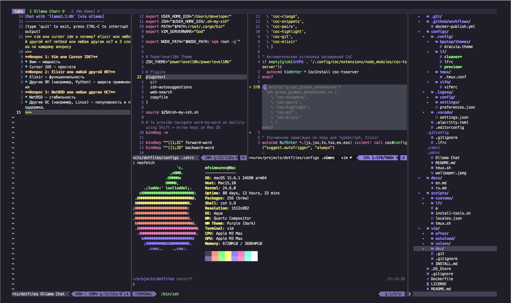

# Dotfiles & Development Tools


Environment configuration and development tools setup automation.

[🇷🇺 Русская версия](docs/ru.md) | [🇬🇧 English version](docs/en.md)

## Demo

### Vim



## Quick Start

### macOS

```bash
git clone https://github.com/the-homeless-god/dotfiles.git ~/dotfiles
cd ~/dotfiles/scripts
./install-tools.sh
```

#### Interactive Mode

For more control over what gets installed, use the interactive mode:

```bash
./install-tools.sh --interactive
```

This provides a checkbox interface to select specific tool categories and individual tools.

### Portable Codex skills

`codex/skills/` ships five company-neutral skills. They are not optional extras
and they are not invoked on request: they are the default operating rules for
any non-trivial engineering initiative run out of this repository. Use all five,
by default, unless the "do not use when" line of a skill excludes it.

**If you are an agent and someone gave you this file, do this:**

1. Install the skills if `${CODEX_HOME:-$HOME/.codex}/skills` does not have them
   yet — `./scripts/install-codex-skills.sh --dry-run`, then the same command
   without `--dry-run`. The default set is read from `codex/skills/`, so every
   bundled skill is installed, and none is overwritten without `--replace`.
2. Open the `description` line at the top of each `SKILL.md`. It names the
   trigger as "use when … ; do not use when …" — treat that as binding, not as
   advice.
3. Compose them in the order below instead of picking whichever one is nearest.
4. Report with `$state`, in every report, at every level.

| Skill | Mandatory when | Do not use when |
|---|---|---|
| `$umbrella-repository-setup` | the initiative spans several independently versioned repositories and needs pinned revisions, shared agent rules, spec-driven artifacts, or an analyst workspace | one repository already owns the whole change |
| `$master-prompt-builder` | a cross-repository or spec-driven initiative must be handed to another agent with alternatives, verification, safety boundaries, artifacts, rollout, and a completion contract | it is a small one-off prompt rewrite |
| `$cluster-agent-setup` | work splits across many concurrent agents, a shared account makes write collisions likely, or agents die in batches on session limits and must resume without re-deriving measurements | one agent finishes the work in one session |
| `$bilingual-documentation` | the repository documents itself in more than one language, a document exists on one surface only, or a number in a document can no longer be reproduced by the command it names | it is product UI localisation, marketing copy, or reference generated from source |
| `$state` | status on long-running work, standups, handovers, any "where are we" question | the answer is a single fact, or the reader asked for depth |

They stack; the order is fixed by the skills themselves, not by taste:

- `$umbrella-repository-setup` goes first whenever more than one repository is in
  play. Everything below embeds its pinned revisions, instruction precedence, and
  component write boundaries — citing it is not applying it.
- `$master-prompt-builder` turns the brief into a prompt another agent can execute
  without inventing product facts, permissions, or completion. It applies the
  umbrella skill itself when the work is cross-repository.
- `$cluster-agent-setup` wraps both when one agent is not enough: stacks defined
  by the files they write, one cell of work per agent, continuity across session
  limits — and it generates each brief with `$master-prompt-builder`.
- `$bilingual-documentation` governs what the work writes down: paired language
  surfaces that state the same facts, a README that routes to documents instead
  of restating them, and every number naming the command that prints it. This
  repository is arranged that way itself — `README.md` routes, `docs/en.md` and
  `docs/ru.md` are the pair.
- `$state` closes every report: five labels, 500 characters, one syllogism drawn
  from two premises already in the report.

Preview and install them into `${CODEX_HOME:-$HOME/.codex}/skills`:

```bash
./scripts/install-codex-skills.sh --dry-run
./scripts/install-codex-skills.sh
```

Existing skills are not overwritten. Use `--replace` to move an existing skill
to a timestamped backup before installing the portable version. A custom target
can be supplied with `--destination DIR`, and named arguments install a subset:
`./scripts/install-codex-skills.sh state`.

Invoke them as `$master-prompt-builder`, `$umbrella-repository-setup`,
`$cluster-agent-setup`, `$bilingual-documentation`, and `$state`.

### Docker

#### Using pre-built image

```bash
# Run container
docker pull ghcr.io/the-homeless-god/dotfiles:latest
docker run -it --name dotfiles ghcr.io/the-homeless-god/dotfiles:latest

# To reconnect to the container later
docker start dotfiles
docker exec -it dotfiles /bin/bash
```

#### Building locally

```bash
# Build and run container
docker build -t dotfiles-test .
docker run -it --name dotfiles-dev dotfiles-test

# To reconnect to the container later
docker start dotfiles-dev
docker exec -it dotfiles-dev /bin/bash
```

## Preview


## CI/CD

This repository uses GitHub Actions for continuous integration and delivery:

- Automatic Docker image builds on every push to main branch
- Automatic releases when tags are pushed
- Image publishing to GitHub Container Registry
- Build caching for faster builds
- Automated tagging system

### Automated Builds

The following events trigger builds:

- Push to main branch
- Creation of tags (vX.Y.Z)
- Pull requests

### Docker Tags

Available tags in the registry:

- `latest` - Latest stable version
- `vX.Y.Z` - Specific version releases
- `main` - Latest development version
- `sha-XXXXXXX` - Specific commit builds

### Registry

Images are published to GitHub Container Registry (ghcr.io):

```bash
ghcr.io/the-homeless-god/dotfiles
```

### Applications

#### General

- [Google Chrome](https://www.google.com/intl/ru_ru/chrome/)
- [Google Chrome: Stylus](https://chromewebstore.google.com/detail/stylus/clngdbkpkpeebahjckkjfobafhncgmne?pli=1)
- [Google Chrome: Logseq Web Clipper](https://chromewebstore.google.com/detail/logseq-web-clipper/fhjehofpeafndgabgbehflkncpmdldgg)
- [Google Chrome: JSON Viewer](https://chromewebstore.google.com/detail/json-viewer/gbmdgpbipfallnflgajpaliibnhdgobh)
- [Google Chrome: Allow CORS](https://chromewebstore.google.com/detail/allow-cors-access-control/lhobafahddgcelffkeicbaginigeejlf)
- [Google Chrome: Digitable: Bionic Reader](https://chromewebstore.google.com/detail/bofckkbophijgakfoeihfmnjfphcabhi)
- Microsoft 365 and Office 16.76.23081101 HomeStudent - lifetime
- [Cursor](https://cursor.com)
- [Krita](https://download.kde.org/stable/krita/)
- [Google Chrome: Digitable: Tools: PWA](https://tools.digitable.life/)
- [1Password](https://my.1password.com/)
- [Macs Fan Control](https://github.com/crystalidea/macs-fan-control?tab=readme-ov-file)

#### MacOS

- [Ollama](https://ollama.com/download)
- [Passepartout](https://passepartoutvpn.app)
- [Magnet](https://magnet.crowdcafe.com)
- [Usage](https://usage.pro)
- [MeetingBar](https://meetingbar.app)
- [Alfred](https://www.alfredapp.com)
- [Telegram](https://macos.telegram.org)
- [UTM](https://mac.getutm.app)
- [Logseq](https://logseq.com)
- [VMware Fusion 13.5.2-23775688]( https://softwareupdate.vmware.com/cds/vmw-desktop/fusion/13.5.2/23775688/universal/core/)
- [Zen Browser](https://zen-browser.app/)

### Build Status

You can check the current build status on the [Actions tab](https://github.com/the-homeless-god/dotfiles/actions) or by the badge at the top of this README.

## License

MIT
