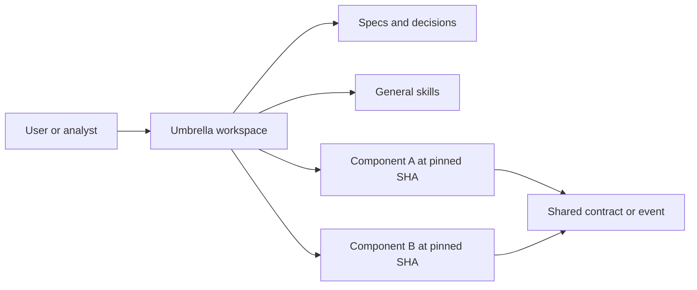

# Umbrella repository bootstrap runbook

Use this guide when creating the workspace or onboarding a new contributor.

## 1. Inventory and access map

For the umbrella and every candidate component, record:

- purpose and owner;
- local path and remote URL;
- default/current branch and exact commit SHA;
- clean/dirty/untracked state;
- local instruction files and project-specific skills;
- build, test, lint, code generation, and setup commands;
- read/write access and unresolved blockers.

Stop before mutation if an existing directory would need to be overwritten,
moved, or converted. Preserve it and choose a separate clean worktree or path.

## 2. Choose the repository model

Write a short decision record comparing pinned submodules, a specification-only
workspace, a monorepo, and coordinated independent repositories. Include:

- ownership and release independence;
- reproducibility requirements;
- expected cross-repository change frequency;
- access restrictions;
- CI cost and onboarding complexity;
- migration and rollback.

## 3. Register components safely

For a submodule-based umbrella:

1. verify the umbrella remote and clean worktree;
2. verify each component remote and chosen revision;
3. use `git submodule add <remote> <path>` for a new empty target path;
4. inspect `.gitmodules`, then commit the gitlink pointers;
5. run `git submodule status --recursive`;
6. record the selected revisions and why they were chosen.

Do not delete a standalone checkout's `.git` directory or hand-edit gitlinks to
simulate registration. If components already exist in conflicting paths, use a
clean worktree or reconstruct the umbrella in a separate directory.

## 4. Root instruction hierarchy

Create `AGENTS.md` with:

- umbrella purpose and component map;
- authority order between root and component instructions;
- default agent role and when specialist agents may be used;
- read/write boundaries per component;
- setup and verification commands per component;
- generated/restricted paths;
- cross-repository contract and review checks;
- spec workflow and completion reporting.

Do not copy every component rule into the root. Summarize shared routing and
link to the component's own instructions to avoid drift.

## 5. Principles, memory, and skills

- Put durable cross-repository principles in `CONSTITUTION.md` or the framework's
  canonical constitution path.
- Keep source registers, research journals, decisions, assumptions, and blockers
  under the initiative spec rather than in an opaque conversational memory.
- Keep general research, TDR, planning, issue-tracker, and diagram skills at the
  umbrella level.
- Discover component-specific skills in each component. Install or change them
  there only through a separately authorized component workflow.

## 6. Spec-driven layout

Start with one umbrella initiative spec. Add feature/capability specs when they
have separate actors, lifecycle, contracts, risks, or delivery ownership.

Recommended initiative artifacts:

- `spec.md`: problem, scope, actors, requirements, NFR, acceptance scenarios;
- `plan.md`: repository decision, architecture, phases, dependencies, rollout;
- `tasks.md`: dependency-ordered work and component PR boundaries;
- `tdr.md`: evidence, alternatives, decision, consequences, migration;
- `journey.md`: optional user journey/CJM for analyst-led work;
- `memory.md`: compact current context and unresolved decisions;
- `traceability.md`: requirement → source → design → component → test → PR;
- `research/`: source register, journal, decisions, assumptions, blockers.

## 7. README and architecture view

The root README should let a new contributor answer:

- what the umbrella owns and does not own;
- how components connect;
- how to clone and initialize;
- how to inspect pinned revisions;
- how to update a component pointer intentionally;
- where specs, general skills, component rules, and commands live.

Include a Mermaid C3-style component view only when it improves navigation. A
portable starting point:



## 8. Fresh-clone proof

Test onboarding from a separate clean directory:

```bash
git clone --recurse-submodules <umbrella-url>
cd <umbrella-directory>
git submodule sync --recursive
git submodule update --init --recursive
git submodule status --recursive
```

Then run lightweight discovery/validation commands documented for each
component. Missing credentials or private dependencies must produce explicit
setup instructions, not secret placeholders committed to the repository.

## 9. Update protocol

When intentionally advancing a component:

1. fetch inside that component only with the required authorization;
2. select a named branch/tag/commit rather than an unreviewed latest revision;
3. inspect the old-to-new diff and cross-component contract impact;
4. run mapped checks;
5. commit the pointer change in the umbrella with revision evidence;
6. keep component source changes in the component's own PR.

Avoid automated `submodule update --remote` in reproducible analysis workflows
unless an explicit policy defines the tracked branch, validation, and review.
